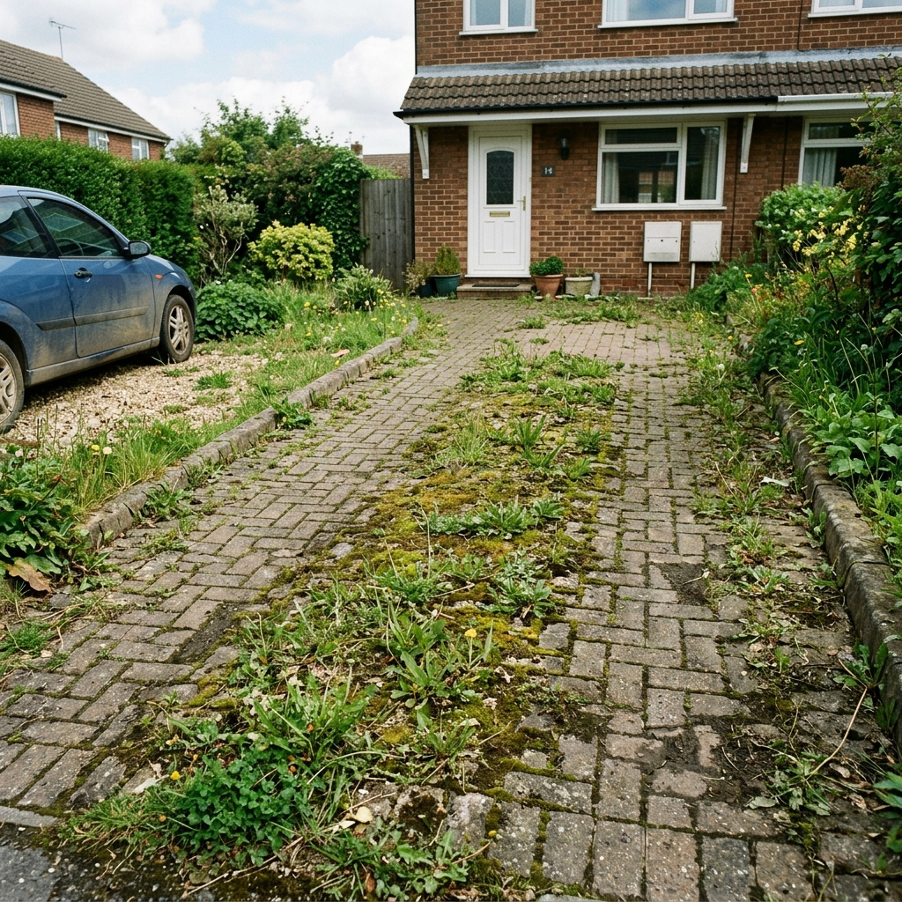

# Levenmouth Exterior Cleaning — Website

A single-page, animation-rich marketing site for Levenmouth Exterior Cleaning. Plain HTML/CSS/JS — no build step, no framework, no backend. Deploy the folder as-is to any static host.

## Stack

- Plain HTML + hand-written CSS (design tokens from `design-identity/`, remapped to the brand's navy/cyan palette)
- [GSAP](https://gsap.com/) + ScrollTrigger, loaded from cdnjs, for scroll reveals, hero entrance, counters and the before/after wipe
- No Tailwind/build step was used in the end — the token system from `design-identity/tailwind.config.js` was ported directly into `css/styles.css` as CSS custom properties instead, so the site works by opening `index.html` with zero install steps

## Running locally

No install needed. Either:

- Open `index.html` directly in a browser, or
- Serve the folder so relative paths and the Google Map iframe behave exactly as in production:
  ```
  python -m http.server 8000
  ```
  then visit `http://localhost:8000`.

## Deploying

Drag-and-drop the whole project folder onto Netlify/Vercel/Cloudflare Pages, or upload via FTP to any static host. There's nothing to build — `index.html`, `css/`, `js/` and `assets/` are the entire deliverable.

Before going live:

1. **Open Graph / canonical URLs** — `index.html` currently uses relative paths for `og:image`/`twitter:image`. Once you know the live domain, either switch these to absolute URLs (`https://yourdomain.co.uk/assets/images/og-image.jpg`) or leave them relative (most platforms resolve relative OG URLs against the page URL, but absolute is safer).
2. **Facebook page link** — the footer's Facebook icon and the JSON-LD `sameAs` field were left as placeholders (search `TODO` in `index.html`) since no exact Facebook page URL was supplied. Add the real URL in both places once confirmed.
3. **Before/after photos** — see below.

## Swapping in real before/after photos

The before/after slider in the "Gallery" section (`#gallery`) currently uses CSS gradient placeholders instead of real photos, clearly labeled "Before"/"After". To swap in real customer photos:

1. Open `index.html` and find the `<!-- TODO: replace with real customer ... photo -->` comments (4 total — before/after × 2 sliders).
2. Replace the relevant `.ba-slider__panel--before` / `.ba-slider__panel--after` `<div>`'s background with an `` tag (or set a `background-image` in an inline style), e.g.:
   ```html
   <div class="ba-slider__panel ba-slider__panel--before">
     
     <span class="ba-slider__tag">Before</span>
   </div>
   ```
3. No JS or CSS changes are needed — the slider's drag/clip-path logic (`js/before-after-slider.js`) works on whatever is inside those panels.
4. Feel free to add more before/after pairs by duplicating a `.ba-slider` block inside `.ba-showcase` — the slider script auto-initializes every `[data-ba-slider]` element on the page.

## Editing content

Everything is in `index.html` — there's no CMS or data file. Testimonials, services, pricing-free copy, contact details, etc. are all plain markup. The WhatsApp number appears in several places (nav, hero, final CTA, floating button, footer) as `https://wa.me/447828450059?text=...` — update all instances if the number ever changes.

## Structure

```
index.html                     — all page content and sections
css/styles.css                 — design tokens + all styling (mobile-first)
js/main.js                     — nav, mobile menu, scroll-spy, floating WhatsApp button
js/animations.js               — GSAP scroll reveals, hero entrance, counters (no-ops gracefully if GSAP fails to load or prefers-reduced-motion is set)
js/before-after-slider.js      — draggable/keyboard-accessible comparison slider
js/testimonials-carousel.js    — autoplay carousel with swipe/keyboard/dot support
assets/images/                 — logo.png (site use), og-image.jpg (social share)
assets/icons/                  — favicon set (all generated from logo.jpg)
```

## Notes on decisions made while building

- **No Tailwind build**: the brief allowed "plain HTML/CSS/JS (or a minimal Vite setup)" — plain was chosen so the client can host this anywhere with zero tooling.
- **No fabricated review ratings or `AggregateRating` schema**: the Facebook reviews are thumbs-up "recommends," not a 1–5 star system, so no star ratings (real or schema.org) were invented per review or in aggregate. The 100%/18-reviews stat is used as-is.
- Every animation degrades gracefully: if GSAP fails to load (CDN blocked, offline, etc.), all content is still fully visible and usable via the CSS defaults — nothing depends on JavaScript to be readable.
